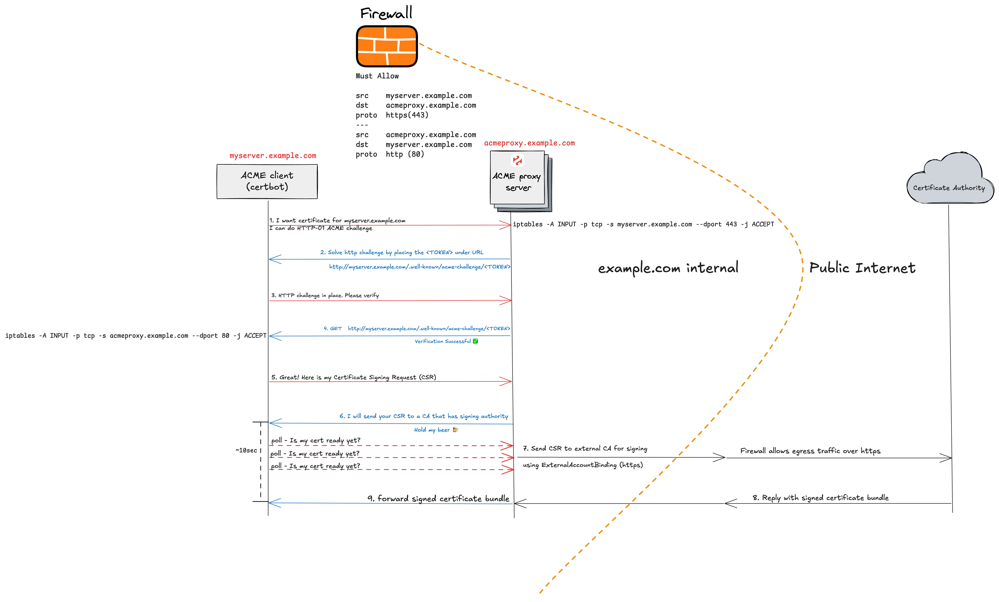

# ACME Server as a Registration Authority

`acme-proxy` is a standalone ACME server built on [step-ca](https://github.com/smallstep/certificates) that operates in [registration authority (RA)](https://smallstep.com/docs/registration-authorities/) mode. It accepts certificate orders and validates certificate requests using the ACME protocol (RFC 8555), but does **NOT** sign certificates or store private keys.

## How It Works

When a client successfully completes an ACME challenge, `acme-proxy` forwards the certificate signing request to an external certificate authority (CA) that supports External Account Binding (EAB). The external CA signs the certificate and returns it to the client through `acme-proxy`.

**Note:** LetsEncrypt does not support EAB. However, commercial CAs such as Sectigo and ZeroSSL do.

## Use Cases

This architecture addresses typical enterprise constraints that prevent direct certificate issuance from LetsEncrypt:

**HTTP-01 Challenge Limitations:**

- Security policies prohibit exposing port 80 to the public internet

**DNS-01 Challenge Limitations:**

- Legacy DNS infrastructure lacks REST API support or ACME client integration
- Security policies restrict distribution of API tokens or TSIG keys for large DNS zones

For more information on DNS-01 security considerations:

- [EFF: Technical Deep Dive on ACME DNS Challenge Validation](https://www.eff.org/deeplinks/2018/02/technical-deep-dive-securing-automation-acme-dns-challenge-validation)
- [LetsEncrypt: DNS-01 Challenge](https://letsencrypt.org/docs/challenge-types/#dns-01-challenge)

## Benefits

Using ACME with commercial CAs in enterprise environments provides several advantages:

**Trusted Certificates:**

- Certificates are signed by publicly trusted CAs are already in system trust stores
- Eliminates the operational burden of distributing and maintaining custom root certificates across endpoints, servers, and client devices

**Automation and Self-Service:**

- Leverage standard ACME clients (Certbot, acme.sh, cert-manager.io) for certificate issuance, automatic renewals.
- Enable self-service certificate requests for development teams

## ACME Proxy Workflow

`acme-proxy` runs as an ACME server inside your enterprise environment, acting as an intermediary between your internal infrastructure and an external certificate authority service (such as Sectigo).

**Certificate Request Flow:**

1. Your internal server (behind a firewall perimeter) requests a certificate from `acme-proxy` using standard ACME clients like certbot, acme.sh or cert-manager.io if you're using Kubernetes.
2. `acme-proxy` presents cryptographic challenges to verify domain ownership
3. Once validation succeeds, `acme-proxy` forwards the certificate signing request to your external CA using External Account Binding (EAB)
4. The external CA signs the certificate
5. `acme-proxy` retrieves the certificate bundle and returns it to your server



## Quick Start

```sh
curl -fsSL https://raw.githubusercontent.com/esnet/acme-proxy/main/install.sh | sudo sh
```

The script installs acme-proxy as a systemd service with sensible defaults, all of which can be overridden with environment variables:

```sh
# Default values (all overridable)
INSTALL_DIR="${INSTALL_DIR:-/opt/acme-proxy}"
DB_DIR="${DB_DIR:-${INSTALL_DIR}/db}"
CONFIG_FILE="${CONFIG_FILE:-${INSTALL_DIR}/ca.json}"
SERVICE_USER="${SERVICE_USER:-acme-proxy}"
SERVICE_GROUP="${SERVICE_GROUP:-acme-proxy}"
```

**Example with custom install directory:**

```sh
curl -fsSL https://raw.githubusercontent.com/esnet/acme-proxy/main/install.sh | \
  sudo INSTALL_DIR=/usr/local/acme-proxy SERVICE_USER=acmeservice sh
```

### Build from source (optional)

Requirements: Go >= 1.25

```sh
❯ git clone https://github.com/esnet/acme-proxy.git
❯ make
```

## Usage

Review and update configuration options in [ca.json](./ca.json) before starting the acme-proxy server.

```sh
vim ca.json
```

The most important parts of the config are -

```json
  "dnsNames": ["acmeproxy.example.com"],
  ...
  "authority": {
    "type": "externalcas",
    "config": {
      "ca_url": "",
      "account_email": "",
      "eab_kid": "",
      "eab_hmac_key": "",
      "certlifetime": 30,
      "metrics": {
        "enabled": true,
        "port": 9123
      }
    },
  ...
    "commonName": "acmeproxy.example.com"
  }
```

`ca_url` : ACME directory URL of external certificate authority. To get signed certs from InCommon use `https://acme.sectigo.com/v2/InCommonRSAOV`

Most commercial certificate authorities (such as Sectigo) support certificate issuance over external account binding. You will need to get EAB credentials i.e HMAC Key and Key ID associated with your account.

```json
  "account_email": "certadmin@example.com",
  "eab_kid": "",
  "eab_hmac_key": "",
```

### Starting the ACME server

Upon starting the ACME server it automatically obtains a SSL/TLS certificate for itself.

```sh
$ ./step-ca ca.json
badger 2025/07/15 22:12:24 INFO: All 1 tables opened in 0s
badger 2025/07/15 22:12:24 INFO: Replaying file id: 0 at offset: 105133
badger 2025/07/15 22:12:24 INFO: Replay took: 5.99µs
2025/07/15 22:12:25 Building new tls configuration using step-ca x509 Signer Interface
2025/07/15 22:12:25 Initializing ACME client...
2025/07/15 22:12:25 [INFO] acme: Registering account for admin@example.com
2025/07/15 22:12:26 ACME client initialized successfully
2025/07/15 22:12:26 Processing certificate request for domains: [proxy.example.com]
2025/07/15 22:12:26 Starting certificate request processing for domains: [proxy.example.com]
2025/07/15 22:12:26 [INFO] [proxy.example.com] acme: Obtaining bundled SAN certificate given a CSR
2025/07/15 22:12:27 [INFO] [proxy.example.com] AuthURL: https://acme.sectigo.com/v2/InCommonRSAOV/authz/sx4qvINAdWw2IjplmyH6kg
2025/07/15 22:12:27 [INFO] [proxy.example.com] acme: authorization already valid; skipping challenge
2025/07/15 22:12:27 [INFO] [proxy.example.com] acme: Validations succeeded; requesting certificates
2025/07/15 22:12:27 [INFO] Wait for certificate [timeout: 30s, interval: 500ms]
2025/07/15 22:12:33 [INFO] [proxy.example.com] Server responded with a certificate.
2025/07/15 22:12:33 Successfully obtained certificate from InCommon for domains: [proxy.example.com]
2025/07/15 22:12:33 Starting Smallstep CA/0000000-dev (linux/amd64)
2025/07/15 22:12:33 Documentation: https://u.step.sm/docs/ca
2025/07/15 22:12:33 Community Discord: https://u.step.sm/discord
2025/07/15 22:12:33 Config file: ca.json
2025/07/15 22:12:33 The primary server URL is https://acmeproxy.example.com:443
2025/07/15 22:12:33 Root certificates are available at https://acmeproxy.example.com:443/roots.pem
2025/07/15 22:12:33 X.509 Root Fingerprint: a6cf64dbb4c8d5fd19ce48896068db03b533a8d1336c6256a87d00cbb3def3ea
2025/07/15 22:12:33 Serving HTTPS on proxy.example.com:443 ...
```

### Obtaining a certificate

While the example below uses `acme.sh` as the ACME client, we've also tested using `certbot` with equal success.

```sh
$ ./acme.sh --issue \
    --server https://acmeproxy.example.com/acme/acme/directory \
    --domain myserver.example.com \
    --standalone \
    --listen-v6

[Tue 15 Jul 22:41:01 CDT 2025] Using CA: https://acmeproxy.example.com/acme/acme/directory
[Tue 15 Jul 22:41:01 CDT 2025] Standalone mode.
[Tue 15 Jul 22:41:01 CDT 2025] Creating domain key
[Tue 15 Jul 22:41:01 CDT 2025] The domain key is here: /root/.acme.sh/myserver.example.com_ecc/myserver.example.com.key
[Tue 15 Jul 22:41:01 CDT 2025] Single domain='myserver.example.com'
[Tue 15 Jul 22:41:02 CDT 2025] Getting webroot for domain='myserver.example.com'
[Tue 15 Jul 22:41:02 CDT 2025] Verifying: myserver.example.com
[Tue 15 Jul 22:41:02 CDT 2025] Standalone mode server
[Tue 15 Jul 22:41:04 CDT 2025] Success
[Tue 15 Jul 22:41:04 CDT 2025] Verification finished, beginning signing.
[Tue 15 Jul 22:41:04 CDT 2025] Let's finalize the order.
[Tue 15 Jul 22:41:04 CDT 2025] Le_OrderFinalize='https://acmeproxy.example.com/acme/acme/order/ugickkyMzE0hoHZhBLGuGqG3ab1N0hwz/finalize'
[Tue 15 Jul 22:41:12 CDT 2025] Downloading cert.
[Tue 15 Jul 22:41:12 CDT 2025] Le_LinkCert='https://acmeproxy.example.com/acme/acme/certificate/b3A7d7rZA78ijaKwcR0n5xtxf8PAeE1v'
[Tue 15 Jul 22:41:13 CDT 2025] Cert success.
-----BEGIN CERTIFICATE-----
MIIE1jCCBHygAwIBAgIQExzgaVAT9gRo8qefSNVMhzAKBggqhkjOPhxvquwvdyu5
CQYDVQQGEwJVUzESMBAGA1UEChMJSW50ZXJuZXQyMSEwHwYDVQQDExhJbkNvbW1v
biBFQ0MgU2VydmVyIENBIDIwHhcNMjUwNzE2MDAwMDAwWhcNMjYwNzE2MjM1OTU5
WjBpMQswCQYDVQQGEwJVUzETMBEGA1UECBMKQ2FsaWZvcm5pYTEgMB4GA1UEChMX
RW5lcmd5IFNjaWVuY2VzIE5ldHdvcmsxIzAhBgNVBAMTGnNlYmFzdGlhbjEuYWNt
ZS1kZXYuZXMubmV0MFkwEwYHKoZIzj0CAQYIKoZIzj0DAQcDQgAEl+z2kyLu0aHy
79D457pdQSzWNmqsxg83oz3QHgMoP3lwCGk6G461dvbwrAbC+GMAmmlJiWq6Kg6r
3tHKkrJQ5aOCAykwggMlMB8GA1UdIwQYMBaAFDJfCtkYWe1BcSHV7gni2a+y1w+x
MB0GA1UdDgQWBBRnH5X2pNXqYObRzzZgcRhlBH/YijAOBgNVHQ8BAf8EBAMCB4Aw
DAYDVR0TAQH/BAIwADAdBgNVHSUEFjAUBggrBgEFBQcDAQYIKwYBBQUHAwIwSQYD
VR0gBEIwQDA0BgsrBgEEAbIxAQICZzAlMCMGCCsGAQUFBwIBFhdodHRwczovL3Nl
Y3RpZ28uY29tL0NQUzAIBgZngQwBA2692AYDVR0fBDkwNzA1oDOgMYYvaHR0cDov
L2NybC5zZWN0aWdvLmNvbS9JbkNvbW1vbkVDQ1NlcnZlckNBMi5jcmwwcAYIKwYB
BQUHAQEEZDBiMDsGCCsGAQUFBzAChi9odHRwOi8vY3J0LnNlY3RpZ28uY29tL0lu
Q29tbW9uRUNDU2VydmVyQ0EyLmNydDAjBggrBgEFBQcwAYYXaHR0cDovL29jc3Au
c2VjdGlnby5jb20wJQYDVR0RBB4wHIIac2ViYXN0aWFuMS5hY21lLWRldi5lcy5u
ZXQwggF+BgorBgEEAdZ5AgQCBIIBbgSCAWoBaAB2ANgJVTuUT3r/yBYZb5RPhauw
+Pxeh1UmDxXRLnK7RUsUAAABmBFSahIAAAQDAEcwRQIhALH3c5u5Y6Vns6FhsnNK
JsrL8Fu5qD58fJBHHohL7jKOAiBsXD8Qg+f+RH3Hl7I0G6H0wKWMrGCmM9jyYCsM
XfXXvAB2AKyrMHBs6+yEMfQT0vSRXxEeQiRDsfKmjE88KzunHgLDAAABmBFSac8A
AAQDAEcwRQIhAN3Sd4gWxB0y4aD/0hF4QkbAop6D3tl9t70nFhjvHhLGAiBCT8TQ
Qop++H/BhJcYMVP59BN5ATOBdp4iRNUr/gJL+gB2ANdtfRDRp/V3wsfpX9cAv/mC
yTNaZeHQswFzF8DIxWl3AAABmBFSacsAAAQDAEcwRQIgImeOxwmllsMJHtcH9in5
vTSM+XGMDG/pvHg1Bfyti/QCIQDDzebqT+5OhK0cgNHP0Yyo9IbbFT3hUF5j5ssY
Pn+jCzAKBggqhkjOPQQDAgNIADBFAiEA7UApgH/4lqVIidf6hQt0KS+Wx60I2HoE
oSlzzVurgu0CIFeUruafCMHm2SzuP1eUCgAcMBHtTiugiduq+726bxcw2ln0noLE
-----END CERTIFICATE-----
[Tue 15 Jul 22:41:13 CDT 2025] Your cert is in: /root/.acme.sh/myserver.example.com_ecc/myserver.example.com.cer
[Tue 15 Jul 22:41:13 CDT 2025] Your cert key is in: /root/.acme.sh/myserver.example.com_ecc/myserver.example.com.key
[Tue 15 Jul 22:41:13 CDT 2025] The intermediate CA cert is in: /root/.acme.sh/myserver.example.com_ecc/ca.cer
[Tue 15 Jul 22:41:13 CDT 2025] And the full-chain cert is in: /root/.acme.sh/myserver.example.com_ecc/fullchain.cer

```

### Verify

Let's decode the certificate just to be sure ;-)

```sh
$ openssl x509 -in myserver.example.com.cer -noout -text
Certificate:
    Data:
        Version: 3 (0x2)
        Serial Number:
            13:1c:e0:69:50:13:f6:04:68:f2:a7:9f:48:d5:4c:87
        Signature Algorithm: ecdsa-with-SHA256
        Issuer: C = US, O = Internet2, CN = InCommon ECC Server CA 2
        Validity
            Not Before: Jul 16 00:00:00 2025 GMT
            Not After : Jul 16 23:59:59 2026 GMT
        Subject: C = US, ST = California, O = Energy Sciences Network, CN = myserver.example.com
        Subject Public Key Info:

```

We have our certificate signed by InCommon 🎉

### Renewing a certificate

Issuing a certificate is *generally* not a problem in enterprise environments. But the ability to reliably renew certificates and reload services gracefully post renewal is. I am using the `--force` flag for renewal only because the default configuration in ACME clients only performs automatic renewal `1 < N < 30` number of days before certificate expiration.

```sh
$ ./acme.sh --renew --domain myserver.example.com --force
[Tue 15 Jul 22:50:37 CDT 2025] The domain 'myserver.example.com' seems to already have an ECC cert, let's use it.
[Tue 15 Jul 22:50:37 CDT 2025] Renewing: 'myserver.example.com'
[Tue 15 Jul 22:50:37 CDT 2025] Renewing using Le_API=https://acmeproxy.example.com/acme/acme/directory
[Tue 15 Jul 22:50:38 CDT 2025] Using CA: https://acmeproxy.example.com/acme/acme/directory
[Tue 15 Jul 22:50:38 CDT 2025] Standalone mode.
[Tue 15 Jul 22:50:38 CDT 2025] Single domain='myserver.example.com'
[Tue 15 Jul 22:50:38 CDT 2025] Getting webroot for domain='myserver.example.com'
[Tue 15 Jul 22:50:38 CDT 2025] Verifying: myserver.example.com
[Tue 15 Jul 22:50:38 CDT 2025] Standalone mode server
[Tue 15 Jul 22:50:40 CDT 2025] Success
[Tue 15 Jul 22:50:40 CDT 2025] Verification finished, beginning signing.
[Tue 15 Jul 22:50:40 CDT 2025] Let's finalize the order.
[Tue 15 Jul 22:50:40 CDT 2025] Le_OrderFinalize='https://acmeproxy.example.com/acme/acme/order/qImka7i2D609vh5gLrW6VOwGDoXtd0Mi/finalize'
[Tue 15 Jul 22:50:47 CDT 2025] Downloading cert.
[Tue 15 Jul 22:50:47 CDT 2025] Le_LinkCert='https://acmeproxy.example.com/acme/acme/certificate/f1Am3j0kYAKZa8pl8TXmxvPHoNiBTusU'
[Tue 15 Jul 22:50:48 CDT 2025] Cert success.
-----BEGIN CERTIFICATE-----
MIIE1TCCBHugAwIBAgIQdNISA47bpyNGREPFAKQnljAKBggqhkjOPQQDAjBEMQsw
CQYDVQQGEwJVUzESMBAGA1UEChMJSW50ZXJuZXQyMSEwHwYDVQQDExhJbkNvbW1v
biBFQ0MgU2VydmVyIENBIDIwHhcNMjUwNzE2MDAwMDAwWhcNMjYwNzE2MjM1OTU5
WjBpMQswCQYDVQQGEwJVUzETMBEGA1UECBMKQ2FsaWZvcm5pYTEgMB4GA1UEChMX
RW5lcmd5IFNjaWVuY2VzIE5ldHdvcmsxIzAhBgNVBAMTGnNlYmFzdGlhbjEuYWNt
ZS1kZXYuZXMubmV0MFkwEwYHKoZIzj0CAQYIKoZIzj0DAQcDQgAEl+z2kyLu0aHy
79D457pdQSzWNmqsxg83oz3QHgMoP3lwCGk6G461dvbwrAbC+GMAmmlJiWq6Kg6r
3tHKkrJQ5aOCAygwggMkMB8GA1UdIwQYMBaAFDJfCtkYWe1BcSHV7gni2a+y1w+x
MB0GA1UdDgQWBBRnH5X2pNXqYObRzzZgcRhlBH/YijAOBgNVHQ8BAf8EBAMCB4Aw
DAYDVR0TAQH/BAIwADAdBgNVHSUEFjAUBggrBgEFBQcDAQYIKwYBBQUHAwIwSQYD
VR0gBEIwQDA0BgsrBgEEAbIxAQICZzAlMCMGCCsGAQUFBwIBFhdodHRwczovL3Nl
Y3RpZ28uY29tL0NQUzAIBgZngQwBAgIwQAYDVR0fBDkwNzA1oDOgMYYvaHR0cDov
L2NybC5zZWN0aWdvLmNvbS9JbkNvbW1vbkVDQ1NlcnZlckNBMi5jcmwwcAYIKwYB
BQUHAQEEZDBiMDsGCCsGAQUFBzAChi9odHRwOi8vY3J0LnNlY3RpZ28uY29tL0lu
Q29tbW9uRUNDU2VydmVyQ0EyLmNydDAjBggrBgEFBQcwAYYXaHR0cDovL29jc3Au
c2VjdGlnby5jb20wJQYDVR0RBB4wHIIac2ViYXN0aWFuMS5hY21lLWRldi5lcy5u
ZXQwggF9BgorBgEEAdZ5AgQCBIIBbQSCAWkBZwB2ANgJVTuUT3r/yBYZb5RPhauw
+Pxeh1UmDxXRLnK7RUsUAAABmBFbMBYAAAQDAEcwRQIhAIE0gbe7S4DVa0LE7cky
iDkdmmYdfunYLXIunkgpQJzhAiAkMXHsPW6vD/eDOqbSEQ5ZEHMAedVQqXX93R7s
yWlWnAB2AKyrMHBs6+yEMfQT0vSRXxEeQiRDsfKmjE88KzunHgLDAAABmBFbMAYA
AAQDAEcwRQIgb89l1Uaxy6w2EcYXcL03GW6H7Za40nrCAqw5cNXCm3ICIQDte890
mF6BYRZjG4pMNMeKxkACEd+qp5No+IomQDBtBwB1ANdtfRDRp/V3wsfpX9cAv/mC
yTNaZeHQswFzF8DIxWl3AAABmBFbL6IAAAQDAEYwRAIgepFqZQ6sq/GeeSwW5xDI
QceZj46e/GFc2REwnd5AwuoCIGzSbkCnAQ8lx9eaNFsuijDbVXlxG/euX6ak+xod
bCJvMAoGCCqGSM49BAMCA0gAMEUCIHfnyfO8Hz5lM8RXRiZHN1HYqUn0CHwlP1CM
N+c9XyDLAiEAkbrRKBsYc8YSgYviREF9u+gz7jK5JY2dsaRatEfb8Eg=
-----END CERTIFICATE-----
[Tue 15 Jul 22:50:48 CDT 2025] Your cert is in: /root/.acme.sh/myserver.example.com_ecc/myserver.example.com.cer
[Tue 15 Jul 22:50:48 CDT 2025] Your cert key is in: /root/.acme.sh/myserver.example.com_ecc/myserver.example.com.key
[Tue 15 Jul 22:50:48 CDT 2025] The intermediate CA cert is in: /root/.acme.sh/myserver.example.com_ecc/ca.cer
[Tue 15 Jul 22:50:48 CDT 2025] And the full-chain cert is in: /root/.acme.sh/myserver.example.com_ecc/fullchain.cer
```

Cert renewal was a success! ✨

### WARNING ⚠️

This is a work in progress. Not quite ready for production but will be very soon.

#### TODO

- [x] Move config bits from env vars to `ca.json`
- [x] Implement Revoke method
- [x] Re-assess if `GetCertificateAuthority` is a requirement or not
- [x] Write unit tests
- [ ] Prometheus metrics
- [ ] Write admin docs
- [ ] Write user docs
- [ ] Write Helm chart
